# Codes PlantUML — Tous les diagrammes du rapport CRM

> [!NOTE]
> 14 diagrammes au total, copiez chaque bloc dans [plantuml.com/plantuml](https://www.plantuml.com/plantuml/uml/) pour générer le PNG/SVG.

---

## Chapitre 2 — Diagrammes de cas d'utilisation

### 2.7.1 — Cas d'utilisation global

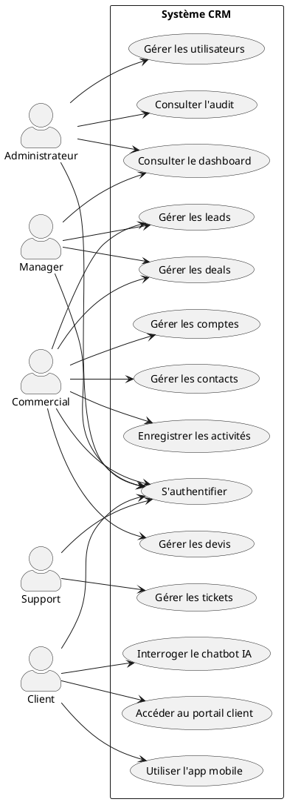

### 2.7.2 — Gestion des Leads

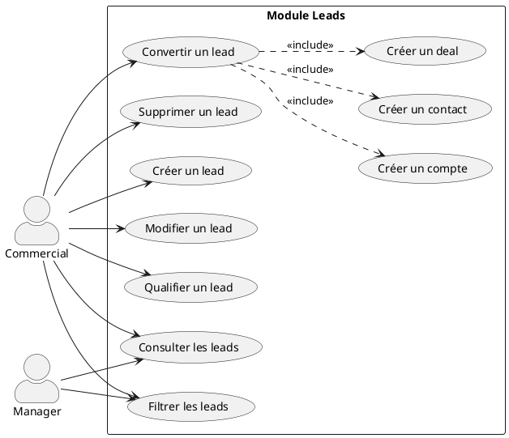

### 2.7.3 — Gestion des Tickets

```plantuml
@startuml UC_Tickets
left to right direction
skinparam actorStyle awesome
skinparam packageStyle rectangle

rectangle "Module Tickets" {
  (Créer un ticket) as CT
  (Consulter les tickets) as CO
  (Assigner un ticket) as AS
  (Changer le statut) as CS
  (Répondre (message public)) as RP
  (Ajouter une note interne) as NI
  (Clôturer un ticket) as CL
  (Filtrer par priorité / statut) as FI
}

:Client: as Cli
:Support: as Sup
:Manager: as Mgr
:Administrateur: as Adm

Cli --> CT
Cli --> CO
Cli --> RP

Sup --> CO
Sup --> AS
Sup --> CS
Sup --> RP
Sup --> NI
Sup --> CL
Sup --> FI

Mgr --> CO
Mgr --> AS
Mgr --> FI

Adm --> CO
@enduml
```

### 2.7.4 — Portail Client

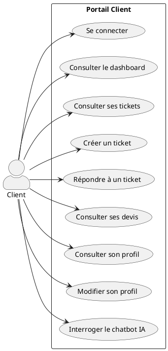

### 2.7.5 — Application Mobile

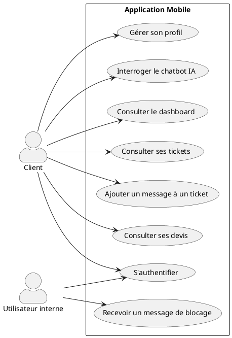

### 2.7.6 — Chatbot IA (RAG)

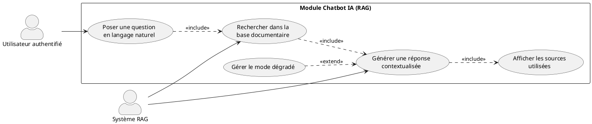

---

## Chapitre 3 — Diagramme de classes

### 3.2 — Diagramme de classes du CRM

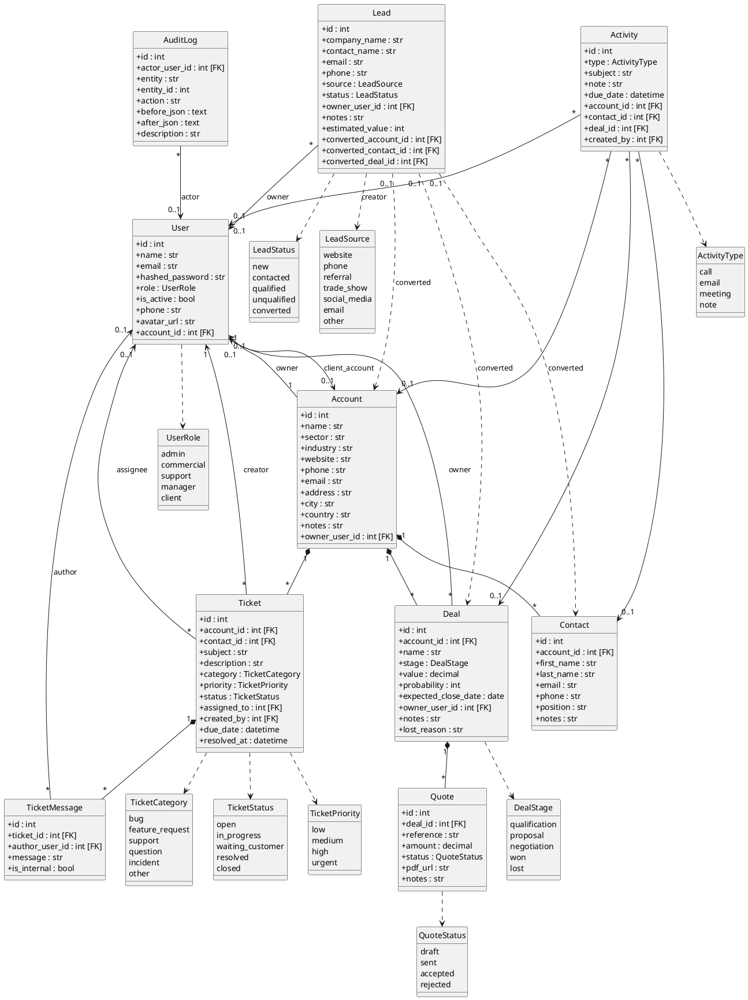

---

## Chapitre 3 — Diagramme Entité-Relation (ERD)

### 3.3 — ERD de la base CRM

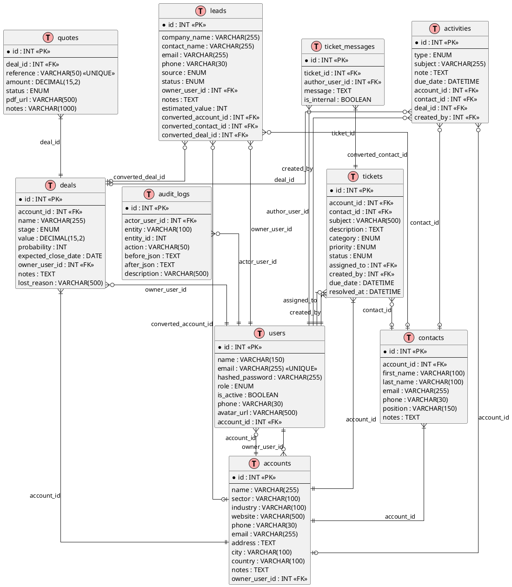

---

## Chapitre 3 — Diagrammes de séquence

### 3.4.1 — Authentification JWT

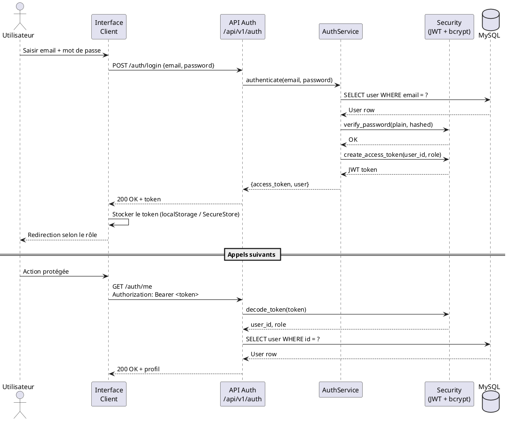

### 3.4.2 — Conversion d'un Lead

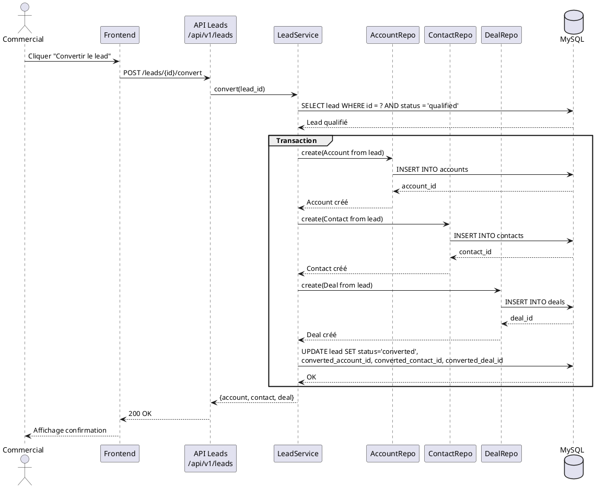

### 3.4.3 — Cycle de vie d'un Ticket

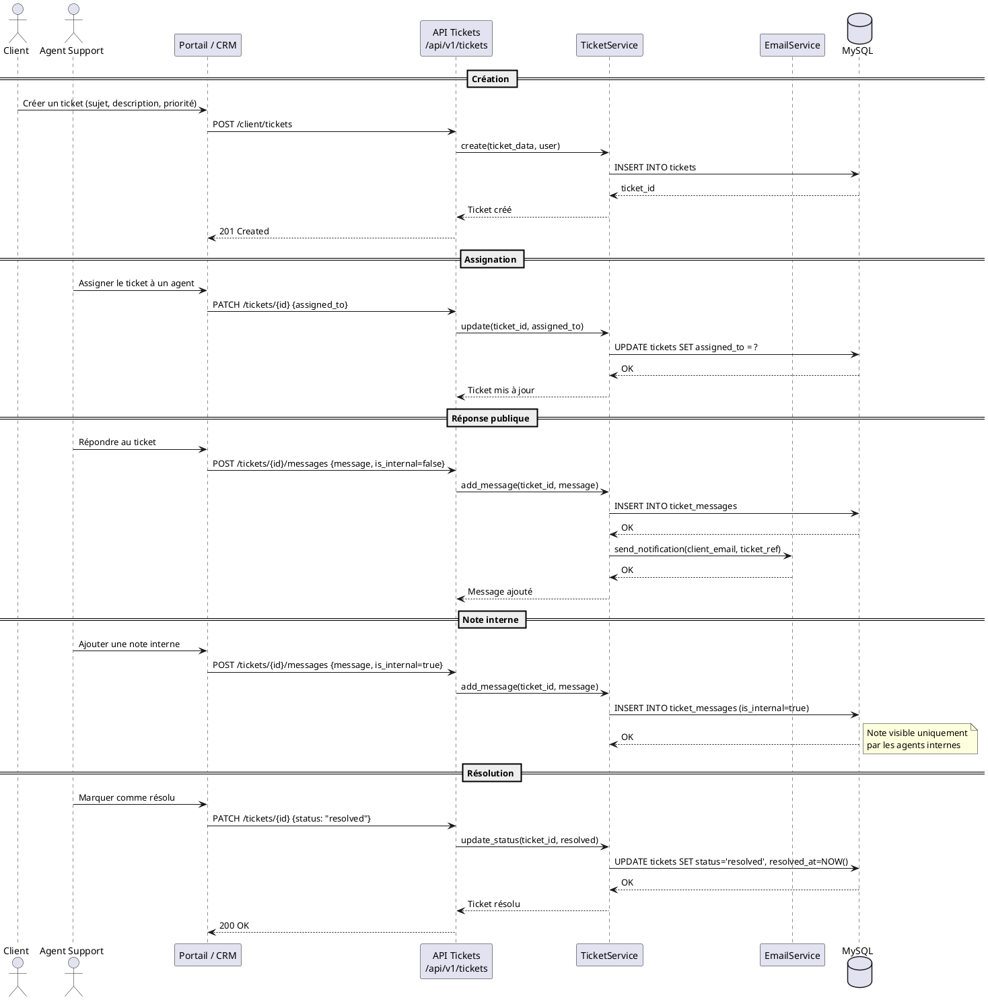

### 3.4.4 — Chatbot documentaire (RAG)

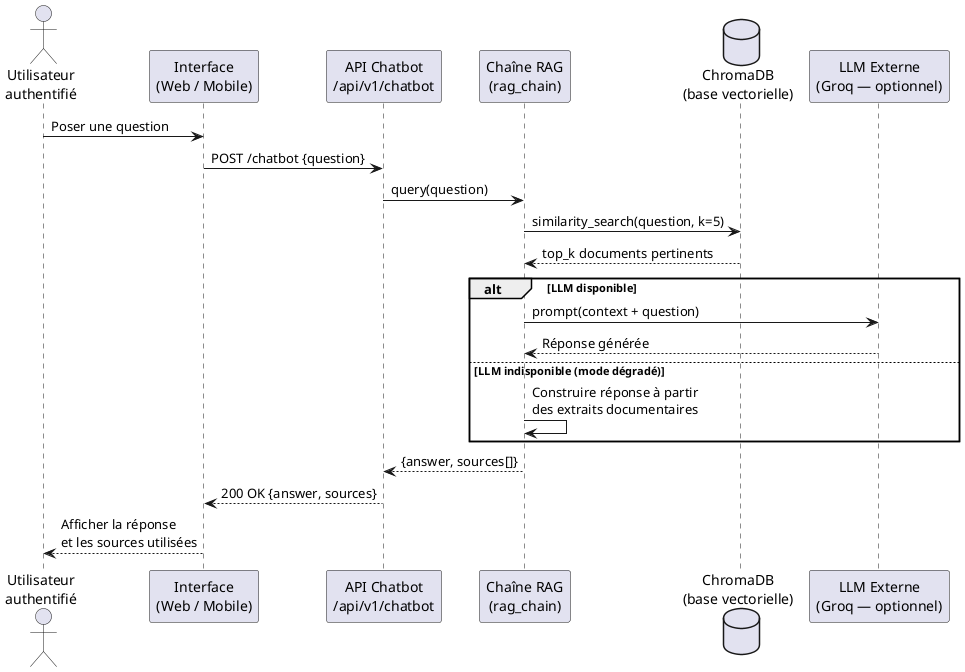

---

## Chapitre 3 — Architecture du module RAG

### 3.6.4 — Architecture RAG

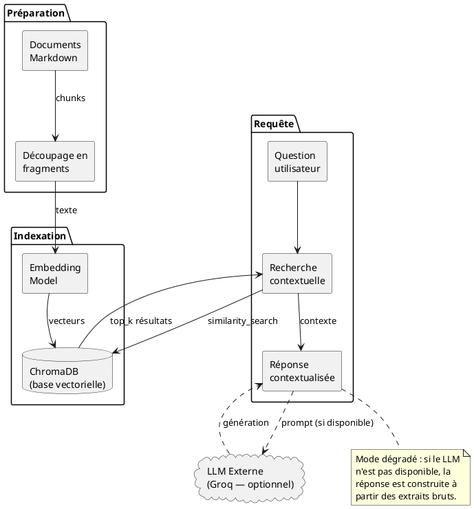

---

## Chapitre 1 — Architecture globale

### 1.7 — Architecture globale du système CRM

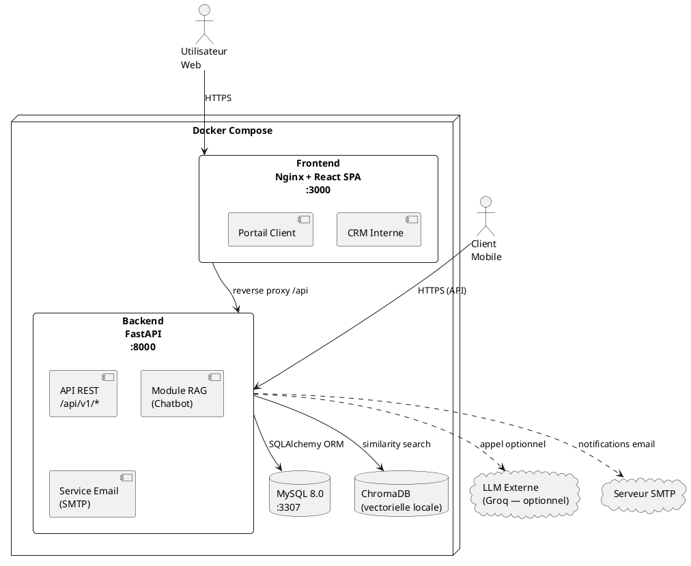
