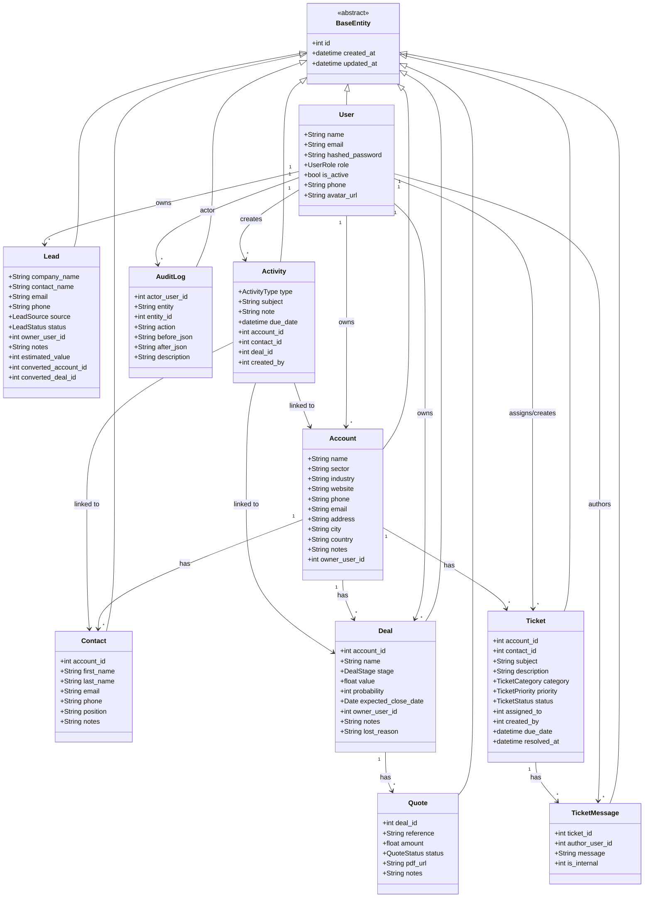
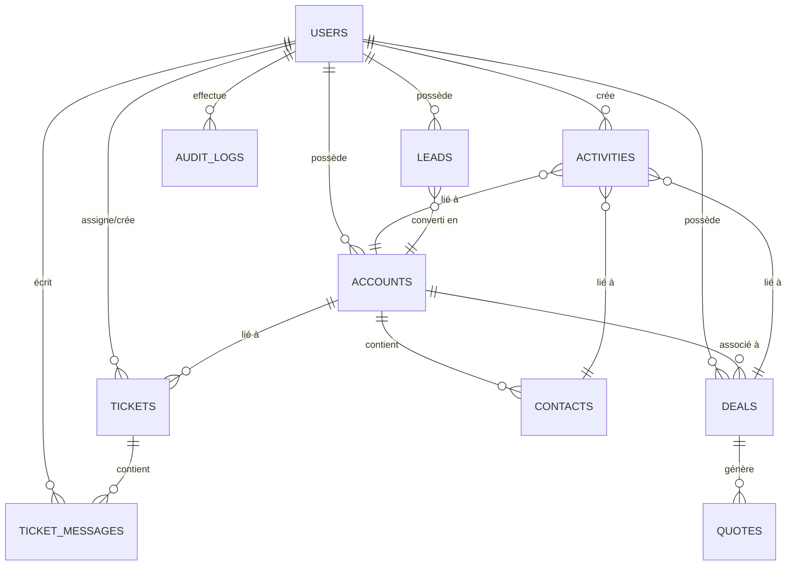
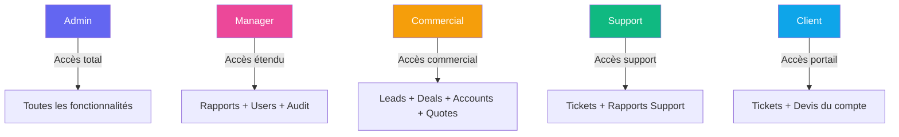
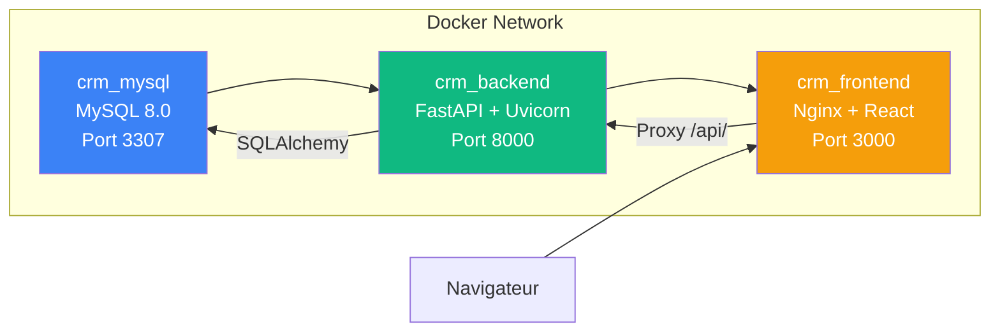
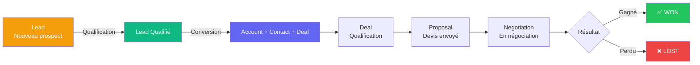
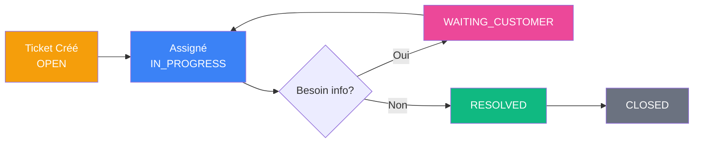

# 📘 CRM INTERNAL — Documentation Technique Complète

> **Version** : 1.0.0  
> **Architecture** : DDD (Domain-Driven Design)  
> **Stack** : FastAPI · React (Vite) · MySQL 8 · Docker  
> **Dernière mise à jour** : Mars 2026

---

## 📑 Table des Matières

1. [Vue d'ensemble](#1-vue-densemble)
2. [Architecture du projet](#2-architecture-du-projet)
3. [Diagramme de Classes (UML)](#3-diagramme-de-classes-uml)
4. [Modèles de données](#4-modèles-de-données)
5. [Modules fonctionnels](#5-modules-fonctionnels)
6. [API Endpoints](#6-api-endpoints)
7. [Authentification & Autorisation](#7-authentification--autorisation)
8. [Frontend (React)](#8-frontend-react)
9. [Infrastructure Docker](#9-infrastructure-docker)
10. [Données de démonstration](#10-données-de-démonstration)

---

## 1. Vue d'ensemble

**CRM Internal** est un système de gestion de la relation client (CRM) interne conçu pour une SSII (Société de Services en Ingénierie Informatique). Il couvre deux axes principaux :

- **🏢 Gestion Commerciale** : Leads → Accounts → Contacts → Deals → Quotes
- **🎫 Helpdesk (Support)** : Tickets avec messagerie, priorités, SLA et suivi

Le système offre également :
- Un **tableau de bord** avec KPIs en temps réel
- Un **journal d'audit** traçant toutes les actions
- Une gestion des **utilisateurs par rôles** (RBAC)
- Un **pipeline commercial** visuel avec étapes

---

## 2. Architecture du projet

```
crm/
├── docker-compose.yml          # Orchestration des 3 conteneurs
├── CRM_DOCUMENTATION.md        # Ce fichier
│
├── backend/                    # API FastAPI (Python 3.11)
│   ├── Dockerfile
│   ├── requirements.txt
│   ├── seed.py                 # Script de données de démo
│   └── app/
│       ├── main.py             # Point d'entrée FastAPI
│       ├── config.py           # Configuration (.env)
│       ├── database.py         # Connexion SQLAlchemy
│       ├── api/
│       │   ├── deps.py         # Dépendances (auth, pagination)
│       │   └── v1/             # Routers API versionnés
│       │       ├── auth_router.py
│       │       ├── users_router.py
│       │       ├── accounts_router.py
│       │       ├── contacts_router.py
│       │       ├── leads_router.py
│       │       ├── deals_router.py
│       │       ├── activities_router.py
│       │       ├── quotes_router.py
│       │       ├── tickets_router.py
│       │       └── dashboard_router.py
│       ├── domain/             # Couche métier (DDD)
│       │   ├── auth/           # Users & Authentication
│       │   ├── accounts/       # Entreprises clientes
│       │   ├── contacts/       # Contacts personnes
│       │   ├── leads/          # Prospects
│       │   ├── deals/          # Affaires / Pipeline
│       │   ├── activities/     # Timeline (appels, RDV, emails)
│       │   ├── quotes/         # Devis
│       │   ├── tickets/        # Helpdesk
│       │   ├── audit/          # Journal d'audit
│       │   └── dashboard/      # Rapports & KPIs
│       ├── shared/             # Code partagé
│       │   ├── base_model.py   # BaseEntity (id, created_at, updated_at)
│       │   ├── base_repository.py
│       │   ├── pagination.py
│       │   └── security.py     # JWT, hashing
│       └── infrastructure/
│           └── middleware.py   # Request logging
│
├── frontend/                   # React + Vite
│   ├── Dockerfile              # Multi-stage (Node → Nginx)
│   ├── nginx.conf              # Proxy API
│   ├── package.json
│   └── src/
│       ├── App.jsx             # Routes principales
│       ├── context/
│       │   └── AuthContext.jsx # Provider auth global
│       ├── services/
│       │   └── api.js          # Axios instance + interceptors
│       ├── components/
│       │   ├── Layout.jsx      # Structure principale
│       │   └── Sidebar.jsx     # Navigation latérale
│       └── pages/
│           ├── LoginPage.jsx
│           ├── DashboardPage.jsx
│           ├── AccountsPage.jsx
│           └── DealsPage.jsx
```

### Pattern DDD par domaine

Chaque domaine suit la même structure :
```
domain/<nom>/
├── models.py       # Entités SQLAlchemy
├── schemas.py      # DTOs Pydantic (Request/Response)
├── service.py      # Logique métier
├── repository.py   # Accès aux données
└── __init__.py
```

---

## 3. Diagramme de Classes (UML)

### 3.1 Diagramme global des entités



### 3.2 Diagramme des énumérations

```mermaid
classDiagram
    class UserRole {
        <<enumeration>>
        ADMIN = "admin"
        COMMERCIAL = "commercial"
        SUPPORT = "support"
        MANAGER = "manager"
        CLIENT = "client"
    }

    class LeadSource {
        <<enumeration>>
        WEBSITE = "website"
        PHONE = "phone"
        REFERRAL = "referral"
        TRADE_SHOW = "trade_show"
        SOCIAL_MEDIA = "social_media"
        EMAIL = "email"
        OTHER = "other"
    }

    class LeadStatus {
        <<enumeration>>
        NEW = "new"
        CONTACTED = "contacted"
        QUALIFIED = "qualified"
        UNQUALIFIED = "unqualified"
        CONVERTED = "converted"
    }

    class DealStage {
        <<enumeration>>
        QUALIFICATION = "qualification"
        PROPOSAL = "proposal"
        NEGOTIATION = "negotiation"
        WON = "won"
        LOST = "lost"
    }

    class ActivityType {
        <<enumeration>>
        CALL = "call"
        EMAIL = "email"
        MEETING = "meeting"
        NOTE = "note"
    }

    class QuoteStatus {
        <<enumeration>>
        DRAFT = "draft"
        SENT = "sent"
        ACCEPTED = "accepted"
        REJECTED = "rejected"
    }

    class TicketPriority {
        <<enumeration>>
        LOW = "low"
        MEDIUM = "medium"
        HIGH = "high"
        URGENT = "urgent"
    }

    class TicketStatus {
        <<enumeration>>
        OPEN = "open"
        IN_PROGRESS = "in_progress"
        WAITING_CUSTOMER = "waiting_customer"
        RESOLVED = "resolved"
        CLOSED = "closed"
    }

    class TicketCategory {
        <<enumeration>>
        BUG = "bug"
        FEATURE_REQUEST = "feature_request"
        SUPPORT = "support"
        QUESTION = "question"
        INCIDENT = "incident"
        OTHER = "other"
    }
```



### 3.3 Diagramme des relations (simplifié)



---

## 4. Modèles de données

### 4.1 `BaseEntity` (modèle abstrait partagé)

| Champ | Type | Description |
|-------|------|-------------|
| `id` | Integer (PK) | Identifiant unique auto-incrémenté |
| `created_at` | DateTime (TZ) | Date de création |
| `updated_at` | DateTime (TZ) | Date de dernière modification |

### 4.2 `User` — Utilisateurs

| Champ | Type | Contraintes | Description |
|-------|------|-------------|-------------|
| `name` | String(150) | NOT NULL | Nom complet |
| `email` | String(255) | UNIQUE, NOT NULL, INDEX | Adresse email |
| `hashed_password` | String(255) | NOT NULL | Mot de passe hashé (bcrypt) |
| `role` | Enum(UserRole) | NOT NULL | Rôle : admin, commercial, support, manager, client |
| `is_active` | Boolean | DEFAULT true | Compte actif/désactivé |
| `phone` | String(30) | Nullable | Numéro de téléphone |
| `avatar_url` | String(500) | Nullable | URL de l'avatar |

### 4.3 `Account` — Entreprises Clientes

| Champ | Type | Contraintes | Description |
|-------|------|-------------|-------------|
| `name` | String(255) | NOT NULL, INDEX | Raison sociale |
| `sector` | String(100) | Nullable | Secteur (IT, Finance, BTP…) |
| `industry` | String(100) | Nullable | Industrie |
| `website` | String(500) | Nullable | Site web |
| `phone` | String(30) | Nullable | Téléphone |
| `email` | String(255) | Nullable | Email de contact |
| `address` | Text | Nullable | Adresse complète |
| `city` | String(100) | Nullable | Ville |
| `country` | String(100) | Nullable | Pays |
| `notes` | Text | Nullable | Notes internes |
| `owner_user_id` | FK → users | Nullable | Responsable commercial |

**Relations** : `contacts`, `deals`, `tickets`, `owner`

### 4.4 `Contact` — Contacts Personnes

| Champ | Type | Contraintes | Description |
|-------|------|-------------|-------------|
| `account_id` | FK → accounts | NOT NULL, INDEX | Entreprise liée |
| `first_name` | String(100) | NOT NULL | Prénom |
| `last_name` | String(100) | NOT NULL | Nom |
| `email` | String(255) | Nullable, INDEX | Email |
| `phone` | String(30) | Nullable | Téléphone |
| `position` | String(150) | Nullable | Poste (CEO, DSI, CTO…) |
| `notes` | Text | Nullable | Notes |

### 4.5 `Lead` — Prospects

| Champ | Type | Contraintes | Description |
|-------|------|-------------|-------------|
| `company_name` | String(255) | Nullable | Nom de l'entreprise prospectée |
| `contact_name` | String(255) | NOT NULL | Nom du contact |
| `email` | String(255) | Nullable, INDEX | Email |
| `phone` | String(30) | Nullable | Téléphone |
| `source` | Enum(LeadSource) | NOT NULL | Source d'acquisition |
| `status` | Enum(LeadStatus) | NOT NULL, INDEX | Statut du lead |
| `owner_user_id` | FK → users | Nullable, INDEX | Commercial responsable |
| `estimated_value` | Integer | Nullable | Valeur estimée (DT) |
| `converted_account_id` | FK → accounts | Nullable | Compte créé après conversion |
| `converted_deal_id` | Integer | Nullable | Deal créé après conversion |

**Processus de conversion** : Lead qualifié → Création automatique : Account + Contact + Deal

### 4.6 `Deal` — Affaires (Pipeline)

| Champ | Type | Contraintes | Description |
|-------|------|-------------|-------------|
| `account_id` | FK → accounts | NOT NULL, INDEX | Compte client |
| `name` | String(255) | NOT NULL | Nom de l'affaire |
| `stage` | Enum(DealStage) | NOT NULL, INDEX | Étape du pipeline |
| `value` | Float | DEFAULT 0 | Montant estimé (DT) |
| `probability` | Integer | DEFAULT 0 | % de probabilité de gain |
| `expected_close_date` | Date | Nullable | Date de clôture prévue |
| `owner_user_id` | FK → users | Nullable, INDEX | Commercial responsable |
| `notes` | Text | Nullable | Notes |
| `lost_reason` | String(500) | Nullable | Raison de perte |

**Pipeline** : `Qualification → Proposal → Negotiation → Won / Lost`

### 4.7 `Activity` — Activités (Timeline)

| Champ | Type | Contraintes | Description |
|-------|------|-------------|-------------|
| `type` | Enum(ActivityType) | NOT NULL | Type : call, email, meeting, note |
| `subject` | String(255) | NOT NULL | Sujet |
| `note` | Text | Nullable | Description |
| `due_date` | DateTime(TZ) | Nullable | Prochaine relance |
| `account_id` | FK → accounts | Nullable, INDEX | Compte lié |
| `contact_id` | FK → contacts | Nullable, INDEX | Contact lié |
| `deal_id` | FK → deals | Nullable, INDEX | Deal lié |
| `created_by` | FK → users | NOT NULL | Créateur |

**Liens polymorphiques** : une activité peut être liée à un compte, un contact et/ou un deal.

### 4.8 `Quote` — Devis

| Champ | Type | Contraintes | Description |
|-------|------|-------------|-------------|
| `deal_id` | FK → deals | NOT NULL, INDEX | Deal associé |
| `reference` | String(50) | UNIQUE | Référence (ex: DEV-2026-001) |
| `amount` | Float | NOT NULL | Montant (DT) |
| `status` | Enum(QuoteStatus) | NOT NULL | Statut : draft, sent, accepted, rejected |
| `pdf_url` | String(500) | Nullable | URL du PDF |
| `notes` | String(1000) | Nullable | Notes |

### 4.9 `Ticket` — Tickets Helpdesk

| Champ | Type | Contraintes | Description |
|-------|------|-------------|-------------|
| `account_id` | FK → accounts | NOT NULL, INDEX | Compte client |
| `contact_id` | FK → contacts | Nullable | Contact demandeur |
| `subject` | String(500) | NOT NULL | Objet du ticket |
| `description` | Text | Nullable | Description détaillée |
| `category` | Enum(TicketCategory) | NOT NULL | Catégorie (bug, support, incident…) |
| `priority` | Enum(TicketPriority) | NOT NULL, INDEX | Priorité (low → urgent) |
| `status` | Enum(TicketStatus) | NOT NULL, INDEX | Statut du ticket |
| `assigned_to` | FK → users | Nullable, INDEX | Agent assigné |
| `created_by` | FK → users | NOT NULL | Créateur |
| `due_date` | DateTime(TZ) | Nullable | Date limite SLA |
| `resolved_at` | DateTime(TZ) | Nullable | Date de résolution |

### 4.10 `TicketMessage` — Messages de Tickets

| Champ | Type | Contraintes | Description |
|-------|------|-------------|-------------|
| `ticket_id` | FK → tickets | NOT NULL, INDEX | Ticket parent |
| `author_user_id` | FK → users | NOT NULL | Auteur du message |
| `message` | Text | NOT NULL | Contenu du message |
| `is_internal` | Integer | DEFAULT 0 | 0 = public, 1 = note interne |

### 4.11 `AuditLog` — Journal d'Audit

| Champ | Type | Contraintes | Description |
|-------|------|-------------|-------------|
| `actor_user_id` | FK → users | NOT NULL, INDEX | Utilisateur ayant effectué l'action |
| `entity` | String(100) | NOT NULL, INDEX | Entité (lead, deal, ticket…) |
| `entity_id` | Integer | NOT NULL | ID de l'entité modifiée |
| `action` | String(50) | NOT NULL | Action (create, update, delete, stage_change…) |
| `before_json` | Text | Nullable | État avant modification (JSON) |
| `after_json` | Text | Nullable | État après modification (JSON) |
| `description` | String(500) | Nullable | Description lisible |

---

## 5. Modules fonctionnels

### 5.1 🔐 Authentification & Utilisateurs

| Fonctionnalité | Description |
|----------------|-------------|
| **Login** | Authentification par email + mot de passe, retour JWT |
| **Register** | Inscription publique (rôle par défaut : `commercial`) |
| **Profil (me)** | Récupérer les infos de l'utilisateur connecté |
| **Liste utilisateurs** | Liste paginée avec filtre par rôle (admin/manager) |
| **Modifier utilisateur** | Mise à jour des infos (admin uniquement) |
| **Changer mot de passe** | Modification du mot de passe |
| **Supprimer utilisateur** | Suppression (admin uniquement) |
| **RBAC** | 5 rôles : Admin, Commercial, Support, Manager, Client |

### 5.2 🏢 Gestion des Comptes (Accounts)

| Fonctionnalité | Description |
|----------------|-------------|
| **CRUD complet** | Créer, lire, modifier, supprimer des entreprises |
| **Pagination & recherche** | Liste paginée avec filtre par secteur et recherche par nom |
| **Relations imbriquées** | Voir contacts, deals et activités d'un compte |
| **Audit automatique** | Toute action est enregistrée dans le journal d'audit |

### 5.3 👤 Gestion des Contacts

| Fonctionnalité | Description |
|----------------|-------------|
| **CRUD complet** | Créer, lire, modifier, supprimer des contacts |
| **Lien au compte** | Chaque contact est rattaché à une entreprise |
| **Filtre par compte** | Filtrer les contacts par `account_id` |
| **Pagination & recherche** | Recherche par prénom |

### 5.4 🎯 Gestion des Leads (Prospects)

| Fonctionnalité | Description |
|----------------|-------------|
| **CRUD complet** | Créer, lire, modifier, supprimer des leads |
| **Filtres multiples** | Par statut, source, commercial, recherche par nom |
| **Pipeline statuts** | NEW → CONTACTED → QUALIFIED → CONVERTED / UNQUALIFIED |
| **⭐ Conversion** | Convertir un lead qualifié → créer auto Account + Contact + Deal |
| **Valeur estimée** | Suivi de la valeur potentielle en DT |

### 5.5 💼 Gestion des Deals (Pipeline)

| Fonctionnalité | Description |
|----------------|-------------|
| **CRUD complet** | Créer, lire, modifier, supprimer des deals |
| **Pipeline commercial** | QUALIFICATION → PROPOSAL → NEGOTIATION → WON / LOST |
| **Changement d'étape** | Endpoint dédié `/deals/{id}/stage` avec audit |
| **Filtres** | Par étape, compte, commercial |
| **Probabilité** | Pourcentage de chances de gagner |
| **Raison de perte** | Champ dédié pour les deals perdus |
| **Activités liées** | Voir les activités d'un deal |

### 5.6 📅 Gestion des Activités

| Fonctionnalité | Description |
|----------------|-------------|
| **CRUD complet** | Créer, lire, modifier, supprimer des activités |
| **4 types** | Appel, Email, Réunion, Note |
| **Liens polymorphiques** | Liée à un compte ET/OU un contact ET/OU un deal |
| **Date de relance** | Suivi des prochaines relances (due_date) |
| **Filtres** | Par type, compte, deal |

### 5.7 📝 Gestion des Devis (Quotes)

| Fonctionnalité | Description |
|----------------|-------------|
| **CRUD complet** | Créer, lire, modifier, supprimer des devis |
| **Lien au deal** | Chaque devis est rattaché à un deal |
| **Workflow statuts** | DRAFT → SENT → ACCEPTED / REJECTED |
| **Référence unique** | Format : DEV-2026-001 |
| **Support PDF** | Champ pour l'URL du document PDF |

### 5.8 🎫 Helpdesk (Tickets)

| Fonctionnalité | Description |
|----------------|-------------|
| **CRUD complet** | Créer, lire, modifier, supprimer des tickets |
| **6 catégories** | Bug, Feature Request, Support, Question, Incident, Other |
| **4 niveaux de priorité** | Low, Medium, High, Urgent |
| **5 statuts** | Open, In Progress, Waiting Customer, Resolved, Closed |
| **Messagerie intégrée** | Messages publics et notes internes |
| **Assignment** | Assigner un agent support |
| **SLA** | Date limite de résolution (due_date) |
| **Suivi résolution** | Date de résolution (resolved_at) |
| **Filtres** | Par statut, priorité, agent, compte |
| **Permissions** | Création : admin, support, manager. Suppression : admin uniquement |

### 5.9 📊 Dashboard & Rapports

| Rapport | KPIs |
|---------|------|
| **Sales Report** | Total leads, leads par source, leads par statut, total deals, pipeline par étape, valeur deals gagnés, taux de conversion |
| **Support Report** | Total tickets, tickets ouverts, tickets en retard, délai moyen de résolution, tickets par statut, tickets par priorité |

### 5.10 📜 Journal d'Audit

| Fonctionnalité | Description |
|----------------|-------------|
| **Traçabilité automatique** | Chaque création, modification, suppression est enregistrée |
| **Snapshots** | État avant/après en JSON |
| **Filtrage** | Par entité (lead, deal, ticket…) |
| **Accès restreint** | Admin et Manager uniquement |

---

## 6. API Endpoints

Base URL : `http://localhost:8000/api/v1`

### 6.1 Auth (`/auth`)

| Méthode | Endpoint | Description | Accès |
|---------|----------|-------------|-------|
| `POST` | `/auth/login` | Connexion (retourne JWT) | Public |
| `POST` | `/auth/register` | Inscription (rôle forcé: `commercial`) | Public |
| `GET` | `/auth/me` | Profil utilisateur connecté | Authentifié |
| `PATCH` | `/auth/me` | Mise à jour du profil (name, phone) | Authentifié |
| `POST` | `/auth/me/change-password` | Changer son propre mot de passe | Authentifié |

### 6.2 Users (`/users`)

| Méthode | Endpoint | Description | Accès |
|---------|----------|-------------|-------|
| `GET` | `/users` | Liste paginée | Admin, Manager |
| `GET` | `/users/{id}` | Détail utilisateur | Authentifié |
| `PATCH` | `/users/{id}` | Modifier utilisateur | Admin |
| `POST` | `/users/{id}/change-password` | Changer mot de passe (self uniquement) | Authentifié |
| `DELETE` | `/users/{id}` | Supprimer utilisateur | Admin |

### 6.3 Accounts (`/accounts`)

| Méthode | Endpoint | Description | Accès |
|---------|----------|-------------|-------|
| `GET` | `/accounts` | Liste paginée (filtre: sector, search) | Authentifié |
| `POST` | `/accounts` | Créer un compte | Authentifié |
| `GET` | `/accounts/{id}` | Détail compte | Authentifié |
| `PATCH` | `/accounts/{id}` | Modifier compte | Authentifié |
| `DELETE` | `/accounts/{id}` | Supprimer compte | Authentifié |
| `GET` | `/accounts/{id}/contacts` | Contacts du compte | Authentifié |
| `GET` | `/accounts/{id}/deals` | Deals du compte | Authentifié |
| `GET` | `/accounts/{id}/activities` | Activités du compte | Authentifié |

### 6.4 Contacts (`/contacts`)

| Méthode | Endpoint | Description | Accès |
|---------|----------|-------------|-------|
| `GET` | `/contacts` | Liste paginée (filtre: account_id) | Authentifié |
| `POST` | `/contacts` | Créer un contact | Authentifié |
| `GET` | `/contacts/{id}` | Détail contact | Authentifié |
| `PATCH` | `/contacts/{id}` | Modifier contact | Authentifié |
| `DELETE` | `/contacts/{id}` | Supprimer contact | Authentifié |

### 6.5 Leads (`/leads`)

| Méthode | Endpoint | Description | Accès |
|---------|----------|-------------|-------|
| `GET` | `/leads` | Liste paginée (filtres: status, source, owner) | Authentifié |
| `POST` | `/leads` | Créer un lead | Authentifié |
| `GET` | `/leads/{id}` | Détail lead | Authentifié |
| `PATCH` | `/leads/{id}` | Modifier lead | Authentifié |
| `DELETE` | `/leads/{id}` | Supprimer lead | Authentifié |
| `POST` | `/leads/{id}/convert` | ⭐ Convertir lead → Account + Deal | Admin, Commercial, Manager |

### 6.6 Deals (`/deals`)

| Méthode | Endpoint | Description | Accès |
|---------|----------|-------------|-------|
| `GET` | `/deals` | Liste paginée (filtres: stage, account, owner) | Authentifié |
| `POST` | `/deals` | Créer un deal | Authentifié |
| `GET` | `/deals/{id}` | Détail deal | Authentifié |
| `PATCH` | `/deals/{id}` | Modifier deal | Authentifié |
| `PATCH` | `/deals/{id}/stage` | ⭐ Changer l'étape du pipeline | Authentifié |
| `DELETE` | `/deals/{id}` | Supprimer deal | Authentifié |
| `GET` | `/deals/{id}/activities` | Activités du deal | Authentifié |

### 6.7 Activities (`/activities`)

| Méthode | Endpoint | Description | Accès |
|---------|----------|-------------|-------|
| `GET` | `/activities` | Liste paginée (filtres: type, account, deal) | Authentifié |
| `POST` | `/activities` | Créer une activité | Authentifié |
| `GET` | `/activities/{id}` | Détail activité | Authentifié |
| `PATCH` | `/activities/{id}` | Modifier activité | Authentifié |
| `DELETE` | `/activities/{id}` | Supprimer activité | Authentifié |

### 6.8 Quotes (`/quotes`)

| Méthode | Endpoint | Description | Accès |
|---------|----------|-------------|-------|
| `GET` | `/quotes` | Liste paginée (filtre: deal_id) | Authentifié |
| `POST` | `/quotes` | Créer un devis | Authentifié |
| `GET` | `/quotes/{id}` | Détail devis | Authentifié |
| `PATCH` | `/quotes/{id}` | Modifier devis | Authentifié |
| `DELETE` | `/quotes/{id}` | Supprimer devis | Authentifié |

### 6.9 Tickets (`/tickets`)

| Méthode | Endpoint | Description | Accès |
|---------|----------|-------------|-------|
| `GET` | `/tickets` | Liste paginée (filtres: status, priority, agent, account) | Authentifié |
| `POST` | `/tickets` | Créer un ticket | Admin, Support, Manager |
| `GET` | `/tickets/{id}` | Détail ticket | Authentifié |
| `PATCH` | `/tickets/{id}` | Modifier ticket | Authentifié |
| `DELETE` | `/tickets/{id}` | Supprimer ticket | Admin |
| `GET` | `/tickets/{id}/messages` | Messages du ticket | Authentifié |
| `POST` | `/tickets/{id}/messages` | Ajouter un message | Authentifié |

### 6.10 Dashboard (`/reports`)

| Méthode | Endpoint | Description | Accès |
|---------|----------|-------------|-------|
| `GET` | `/reports/sales` | Rapport commercial (KPIs) | Admin, Manager, Commercial |
| `GET` | `/reports/support` | Rapport support (KPIs) | Admin, Manager, Support |
| `GET` | `/reports/audit-logs` | Journal d'audit | Admin, Manager |

### 6.11 Client Portal (`/client`)

| Méthode | Endpoint | Description | Accès |
|---------|----------|-------------|-------|
| `GET` | `/client/dashboard` | KPIs du portail client | Client |
| `GET` | `/client/tickets` | Liste des tickets du compte client | Client |
| `POST` | `/client/tickets` | Créer un ticket client | Client |
| `GET` | `/client/tickets/{id}` | Détail ticket (même compte) | Client |
| `GET` | `/client/tickets/{id}/messages` | Messages publics du ticket | Client |
| `POST` | `/client/tickets/{id}/messages` | Ajouter un message public | Client |
| `GET` | `/client/quotes` | Liste des devis du compte client | Client |

### 6.12 System Health

| Methode | Endpoint | Description | Acces |
|---------|----------|-------------|-------|
| `GET` | `/health` | Healthcheck applicatif (status, app, version) | Public |

---

## 7. Authentification & Autorisation

### 7.1 Mécanisme

- **JWT (JSON Web Token)** avec algorithme HS256
- Durée d'expiration : **480 minutes** (8 heures)
- Token envoyé dans le header `Authorization: Bearer <token>`

### 7.2 Rôles et permissions (RBAC)



| Fonctionnalité | Admin | Manager | Commercial | Support | Client |
|----------------|:-----:|:-------:|:----------:|:-------:|:------:|
| Gestion utilisateurs | ✅ | 👁️ | ❌ | ❌ | ❌ |
| Comptes, Contacts | ✅ | ✅ | ✅ | ✅ | ❌ |
| Leads, Deals, Quotes | ✅ | ✅ | ✅ | ❌ | ❌ |
| Conversion de leads | ✅ | ✅ | ✅ | ❌ | ❌ |
| Activités | ✅ | ✅ | ✅ | ✅ | ❌ |
| Tickets (créer) | ✅ | ✅ | ❌ | ✅ | ✅ (portail) |
| Tickets (supprimer) | ✅ | ❌ | ❌ | ❌ | ❌ |
| Rapport commercial | ✅ | ✅ | ✅ | ❌ | ❌ |
| Rapport support | ✅ | ✅ | ❌ | ✅ | ❌ |
| Journal d'audit | ✅ | ✅ | ❌ | ❌ | ❌ |
| Portail client (`/client/*`) | ❌ | ❌ | ❌ | ❌ | ✅ |

---

## 8. Frontend (React)

### 8.1 Pages disponibles

| Page | Route | Description |
|------|-------|-------------|
| Login | `/login` | Page de connexion avec formulaire |
| Dashboard | `/` | Tableau de bord avec KPIs et graphiques |
| Accounts | `/accounts` | Liste des entreprises clientes |
| Contacts | `/contacts` | Gestion des contacts |
| Leads | `/leads` | Gestion des prospects |
| Deals | `/deals` | Pipeline commercial |
| Quotes | `/quotes` | Gestion des devis |
| Tickets | `/tickets` | Helpdesk et messagerie ticket |
| Activities | `/activities` | Timeline des activités |
| Profile | `/profile` | Profil utilisateur connecté |
| Audit Logs | `/audit` | Journal d'audit (admin/manager) |
| Client Dashboard | `/portal` | Dashboard du portail client |
| Client Tickets | `/portal/tickets` | Tickets du compte client |
| Client Quotes | `/portal/quotes` | Devis du compte client |

### 8.2 Composants principaux

- **AuthContext** : Gestion globale de l'authentification (login/logout/token)
- **AppLayout** : Layout interne (menu + header + contenu)
- **ClientLayout** : Layout portail client
- **DashboardPage** : KPIs avec graphiques (Recharts : BarChart, PieChart)

### 8.3 Stack frontend

- **React 19** avec Vite
- **React Router v7** : Routage SPA
- **Axios** : Client HTTP avec interceptors JWT
- **Recharts** : Graphiques du dashboard
- **Ant Design (antd)** : UI components + design tokens
- **Lucide React** + **@ant-design/icons** : Icônes

---

## 9. Infrastructure Docker

### 9.1 Services



| Service | Image | Port | Description |
|---------|-------|------|-------------|
| `crm_mysql` | mysql:8.0 | 3307:3306 | Base de données |
| `crm_backend` | Python 3.11 slim | 8000:8000 | API FastAPI |
| `crm_frontend` | Node 20 → Nginx Alpine | 3000:80 | Interface React |

### 9.2 Variables d'environnement (Backend)

| Variable | Valeur | Description |
|----------|--------|-------------|
| `DATABASE_URL` | `mysql+pymysql://root:root123@db:3306/crm_db` | Connexion MySQL |
| `SECRET_KEY` | `docker-super-secret-key-...` | Clé JWT |
| `ALGORITHM` | `HS256` | Algorithme JWT |
| `ACCESS_TOKEN_EXPIRE_MINUTES` | `480` | Durée du token (8h) |
| `DEBUG` | `true/false` | Mode debug (accepte `dev`, `release`, `prod`) |
| `CORS_ORIGINS` | `http://localhost:3000,http://127.0.0.1:3000` | Origines CORS autorisées |
| `APP_NAME` | `CRM Internal` | Nom de l'application |
| `APP_VERSION` | `1.0.0` | Version |

### 9.3 Commandes Docker

```bash
# Construire et lancer tout
docker-compose up --build -d

# Vérifier l'état
docker-compose ps

# Voir les logs
docker-compose logs -f backend

# Peupler la base de données
docker exec -it crm_backend python -m seed

# Arrêter
docker-compose down

# Arrêter + supprimer les données
docker-compose down -v

# Lancer toute la campagne de tests en Docker (unit + integration + frontend + mobile)
powershell -ExecutionPolicy Bypass -File .\scripts\run_docker_tests.ps1

# Variante: reconstruire aussi toutes les images de test
powershell -ExecutionPolicy Bypass -File .\scripts\run_docker_tests.ps1 -Build

# Executer un seul bloc de tests (profil test)
docker compose --profile test run --rm backend_unit_tests
docker compose --profile test run --rm backend_integration_tests
docker compose --profile test run --rm frontend_tests
docker compose --profile test run --rm mobile_tests
```

---

## 10. Données de démonstration

Le script `seed.py` crée les données suivantes :

### 10.1 Utilisateurs

| Rôle | Email | Mot de passe |
|------|-------|-------------|
| Admin | admin@crm.com | admin123 |
| Commercial | ahmed@crm.com | ahmed123 |
| Commercial | sara@crm.com | sara1234 |
| Support | omar@crm.com | omar1234 |
| Manager | fatima@crm.com | fatima123 |

### 10.2 Données créées

| Entité | Nombre | Exemples |
|--------|--------|----------|
| **Comptes** | 6 | Sonatrach, Djezzy, Cevital, ANEM, Algérie Télécom, Cosider |
| **Contacts** | 7 | DSI, Chef de projet, Directeur IT, Responsable SI… |
| **Leads** | 6 | Mobilis, Ooredoo, Condor Electronics, Brandt, Geant, ENIE |
| **Deals** | 6 | ERP Finance, Infogérance, Intégration SI, Migration Cloud… |
| **Activités** | 5 | Appels, Réunions, Emails, Notes |
| **Devis** | 4 | DEV-2026-001 à DEV-2026-004 |
| **Tickets** | 5 | Bug, Support, Incident, Feature Request |
| **Messages** | 4 | Réponses et notes internes |

---

## 📌 Résumé des flux métier

### Flux Commercial (Sales Pipeline)



### Flux Support (Helpdesk)



---

## 11. Application Mobile (React Native / Expo)

Une application mobile a été développée en complément de l'interface web pour permettre aux utilisateurs d'accéder au CRM depuis leurs téléphones (iOS & Android).

### 11.1 Technologies de l'App
- **Framework** : React Native avec **Expo** (SDK 54)
- **Navigation** : React Navigation v7 (Stack)
- **Requêtes HTTP** : Axios avec gestion centralisée des tokens (intercepteurs)
- **Stockage Tiers** : `expo-secure-store` (stockage sécurisé au lieu de localStorage)
- **UI/UX** : React Native SVG, expo-linear-gradient, Ionicons, etc.
- **Branding** : Utilisation du **Logo FRS** (`FRS_logo`) pour l'icône, le favicon web et le splash screen, fond bleu (`#1565C0`).

### 11.2 Fonctionnalités Actuelles
1. **Login Interactif** : 
   - Mode "Dark Premium" avec animations fluides (orbs).
   - Accès rapide avec comptes de démonstration cliquables (Admin, Commercial, Manager, etc.).
   - Supporte la connexion sur l'API FastAPI locale (auto-détection host Expo, ou variable `EXPO_PUBLIC_API_BASE_URL`).

2. **Profil Utilisateur** :
   - Lecture des informations depuis le jeton `AuthContext`.
   - Couleurs et icônes dynamiques basées sur le "Rôle" (Admin = Indigo, Manager = Rose, Commercial = Orange, Support = Émeraude).
   - Modification des informations (Nom et Téléphone).
   - Bouton de déconnexion sécurisé (efface le cache `SecureStore`).

### 11.3 Comment lancer l'App Mobile

1. Assurez-vous d'être connecté sur le même réseau **Wi-Fi**.
2. Optionnel: définissez `EXPO_PUBLIC_API_BASE_URL` si vous voulez forcer l'URL backend (sinon auto-détection de l'hôte Expo).
3. Lancez le serveur Expo dans PowerShell depuis le dossier de l'app :
   ```bash
   cd mobile
   EXPO_PUBLIC_API_BASE_URL=http://192.168.1.22:8000/api/v1 npx expo start --lan --port 8082
   ```
4. Scannez le QR Code affiché dans le terminal via l'application **Expo Go** disponible sur le store de votre téléphone.

